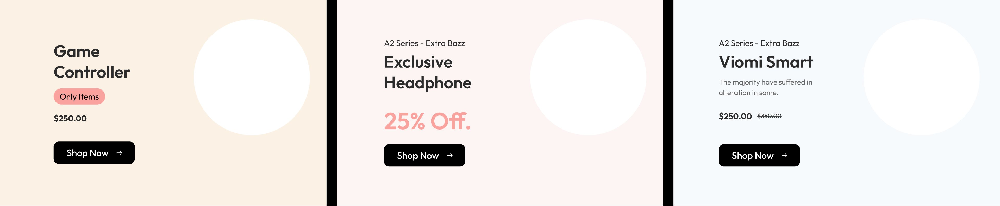
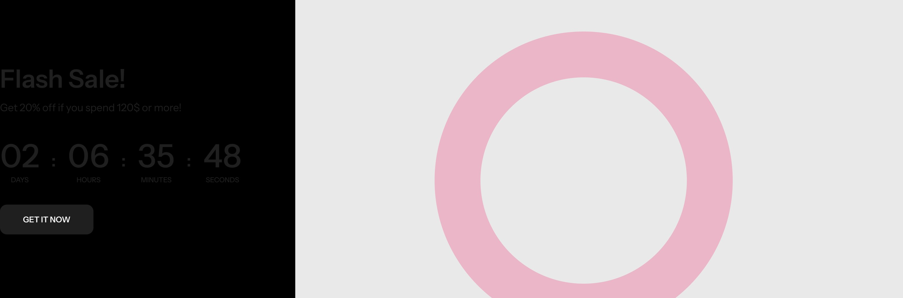
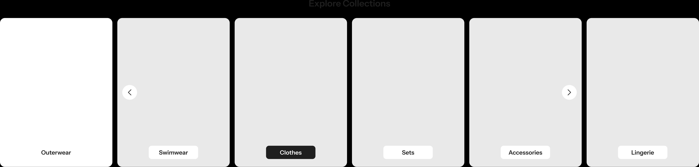
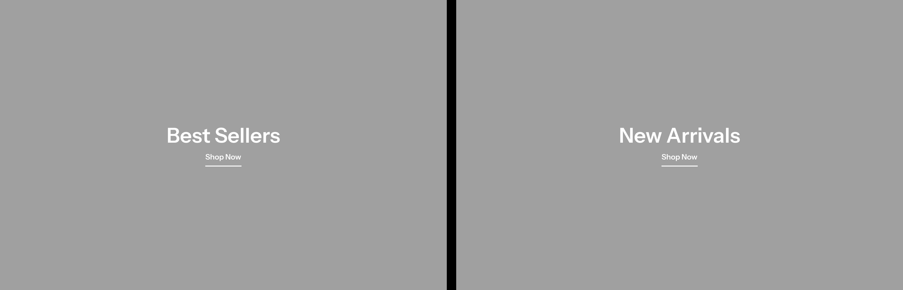

# Brandhub — Storefront Architecture

**Scope:** Website storefront only (not dashboard, not app)
**Market:** Sultanate of Oman · **Direction:** RTL, Arabic-first
**Font:** GE Dinar One
**Reference layout:** noon.com homepage structure

> **Note on components:** Every component named below already exists as a ready design in the Figma file (screenshots in `/components`). This document defines the *structure and order* — which existing component goes where. No new components are invented.

---

## Colors (reference)

| Role | Hex | Usage |
|------|-----|-------|
| Solid purple | `#7F77DD` | Active tabs, hyperlinks, by-influencer chips, key numbers |
| Pink | `#D4537E` | Inside gradient + cart/badge counts only |
| Gold | `#C8A84B` | Basket handle on logo — nowhere else |
| Ink deep | `#1A1A2E` | Footers, sidebars, dark overlays on hero |
| Neutrals | — | ~80% of chrome (do not pull brand palette for chrome) |

---

## Page Structure (top to bottom)

```
┌─ HEADER ────────────────────────────────────┐
│  Section 1 — Main Menu                       │
│  Section 2 — Category Menu (no mega menu)    │
├─ BODY ──────────────────────────────────────┤
│  Section 3 — Hero / Banner                   │
│  Section 4 — المؤثرون المميزون  (no gap ↑)   │
│  Sections 5–10 — from existing components    │
├─ FOOTER ────────────────────────────────────┤
│  Footer                                      │
└─────────────────────────────────────────────┘
```

---

## FIXED SECTIONS (1–4)

### Section 1 — Header: Main Menu
The top navigation bar. Contains (existing components):
- Logo
- Delivery location selector
- Search bar
- Language selector (AR / EN)
- User menu: Account · Orders · Wishlist · Cart (with badge count)

### Section 2 — Header: Category Menu
Secondary navigation — horizontal category bar.
- Row of category links
- **Mega menu is excluded** (ignore the dropdown panels)

### Section 3 — Hero / Banner
The main hero banner area at the top of the body.
- Uses the existing hero/banner component

### Section 4 — المؤثرون المميزون
Featured influencers section.
- Uses the existing **"المؤثرون المميزون"** component
- **No spacing between Section 3 and Section 4** — they sit flush

---

## AVAILABLE COMPONENTS (from Figma)

These are the ready components captured from the Figma file, to be placed into sections 5–10.

### Component A — Promo Banners (×3)


A row of three promotional product banners, each with a light tinted background and a circular product image on the side. Each banner carries: an optional eyebrow line (e.g. "A2 Series – Extra Bazz"), a large product title, an optional pill tag ("Only Items"), a price (with optional strikethrough original price), and a dark **Shop Now** button with an arrow. Layout is three equal columns side by side.

### Component B — Flash Sale (countdown)


A split banner. The left half sits on an ink/black background and holds: a "Flash Sale!" heading, a spend-threshold line ("Get 20% off if you spend 120$ or more!"), a live **countdown timer** broken into DAYS / HOURS / MINUTES / SECONDS, and a **GET IT NOW** button. The right half holds a large circular product image area.

### Component C — Explore Collections


A horizontally scrollable row of tall collection cards on a dark background, titled "Explore Collections". Each card shows a collection image with a label pill at the bottom (Outerwear, Swimwear, Clothes, Sets, Accessories, Lingerie). The active label pill is dark; the rest are light. Left/right circular arrow controls overlay the row for scrolling.

### Component D — Best Sellers / New Arrivals


A full-width dual feature banner split into two equal halves by a thin divider. Each half is a large image area with a centered white heading ("Best Sellers" / "New Arrivals") and an underlined **Shop Now** link beneath it.

### Component E — Circle Category Scroller


A horizontally scrollable row of large circular category thumbnails on a dark background, under a section heading. Each circle has a category label and an item count below it (Clothing (12), Tops (12), Sweaters (12), Dresses (12), Bottoms (12), Shoes (12)). Left/right circular arrow controls sit at the edges for scrolling.

> **Heading note:** the screenshot for Component E currently shows the heading "المؤثرون المميزون" as placeholder text — the component itself is a category circle scroller, so its real heading should be set accordingly when placed.

---

## FLEXIBLE SECTIONS (5–10) — placement

The six body sections below the fixed four are to be filled with Components A–E above. There are **5 components for 6 slots**, so one slot stays open pending a further component.

| Section | Assigned component | Status |
|---------|-------------------|--------|
| 5 | _to assign_ | open |
| 6 | _to assign_ | open |
| 7 | _to assign_ | open |
| 8 | _to assign_ | open |
| 9 | _to assign_ | open |
| 10 | _to assign_ | open |

> **Action needed from you:** confirm the order — which component (A–E) goes into which section number, and what fills the 6th slot.

---

## Footer
Uses the existing footer component.

---

## Notes
- Arabic is primary; the whole interface mirrors RTL.
- Product cards inside any carousel reference the existing product card component.
- This document is structure only — all visual design lives in the Figma components (`/components` holds reference screenshots).
